# N-CITY 💥

## 0. INRTO

### 프로젝트 명 : N-CITY

#### 팀 이름 : 남현동싹쓸어

<br>

<br>

## 1. 서비스 소개

### "NFT + Metaverse"

거래만을 위한 현 NFT 시장에서 나아가, 개인이 보유 혹은 민팅한 NFT를 통해 자신만의 공간을 꾸미고 타 유저들과 소통할 수 있는 서비스

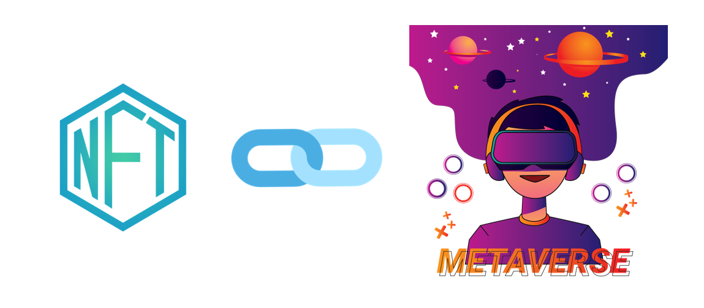

<br>

### 서비스 특장점

1. MetaMask를 통한 손쉬운 회원가입 및 로그인
2. 인증된 사용자가 민팅한 작품 인증마크 
3. NFT 작품 및 N-City에서 제공하는 소품들로 나만의 공간 꾸미기 
4. 자신만의 공간에서 타 유저와 소통
5. 마음에 드는 유저 팔로우 

<br>

### 개발 기간

2022.02.28 ~ 04.08 (6주)

<br>

### 팀원

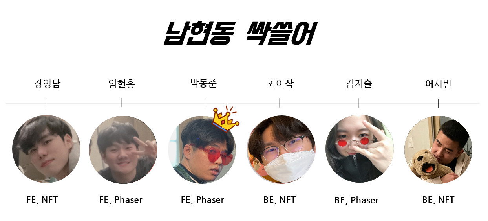

<br>

### ARCHITECTURE

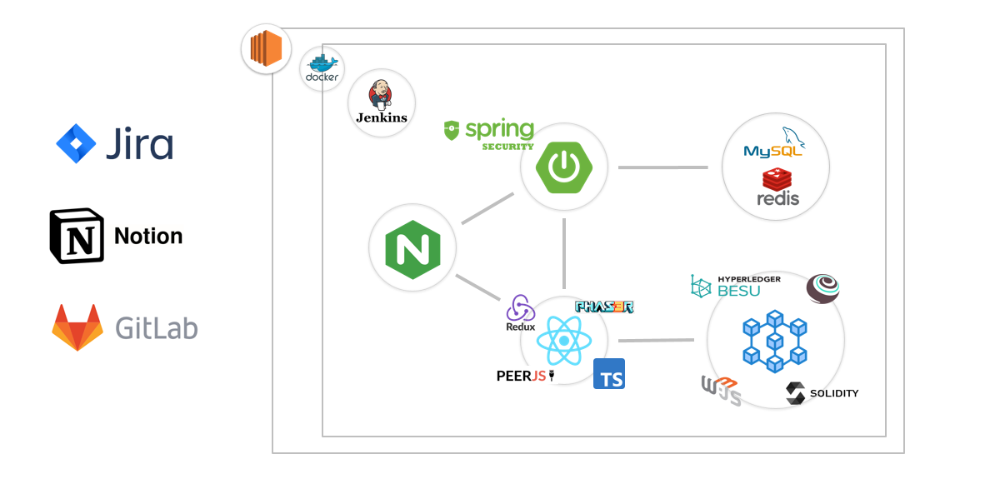

<br>

### CONCEPT

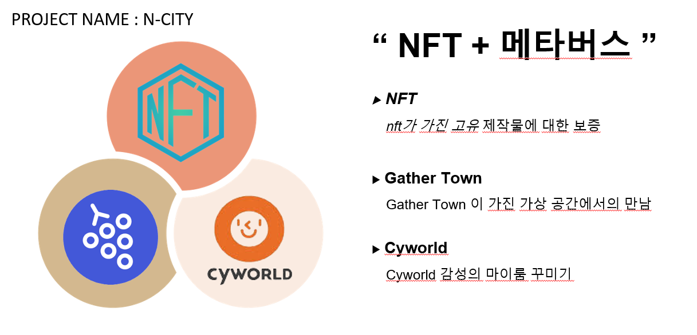


<br>

<br>

## 2. 핵심 기능

#### 1. METAMASK LOGIN

> ***메타마스크(MetaMask)**를 통한 회원가입 및 로그인, 로그아웃
>
> \*메타마스크란 ? 
>
> 이더리움(Ethhereum) 개인지갑을 편리하고 안전하게 관리할 수 있는 구글 확장프로그램.

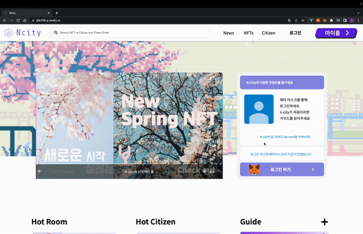

<br>


#### 2. 인증마크

> 회원이 **인플루언서**, **아티스트**, **기업** 세 가지 유형 중 자신이 해당되는 유형을 선택하여 증빙파일과 함께 신청
>
> 관계자가 해당 파일을 검토 후 승인 및 거절
>
> 승인되면 해당 회원이 민팅하는 작품에는 인증배지가 달림

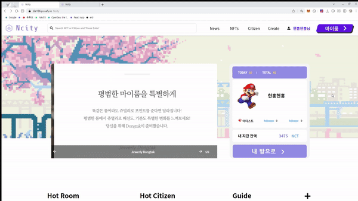


> 승인되면 해당 회원이 민팅하는 작품에는 인증배지가 달림

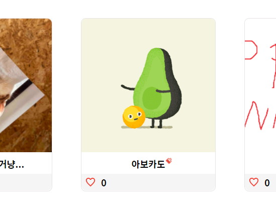

> 승인 완료 시 아티스트 유저에게 나타나는 마크 예시

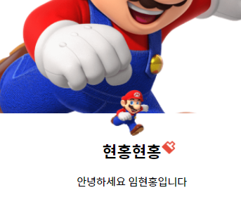

<br>

#### 3. NCT 토큰

> 자체 발행 화폐 단위 사용 NCT 토큰을 이용하여 페이지의 모든 NFT 거래 가능

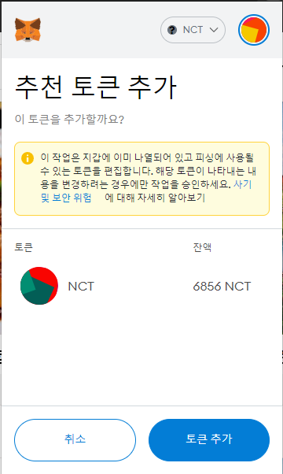


<br>

#### 4. 상품 등록(MINTING)

> 올리고자 하는 작품을 올릴 수 있습니다. (MINTING)
>
> (MINTING 이란?  : NFT를 생성하는 행위를 말하며 메타마스크 계정을 가진 모든 유저가 자유롭게 자신의 작품을 민팅할 수 있습니다.)

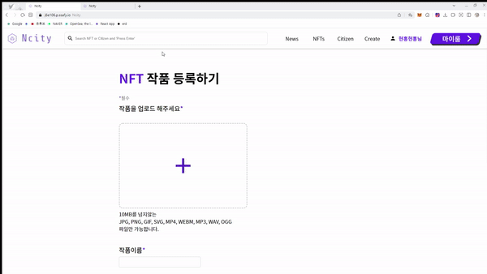


#### 5. 거래 및 경매

> 보유한 NFT 토큰으로 거래 및 경매 가능
>
> 거래의 경우 즉시 구매만 가능합니다.
>
> 

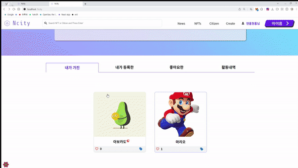


#### 6. MY ROOM 꾸미기

> 1. NFT로 방 꾸미기 
>
> 회원이 작품을 구매하게 되면, 마이룸에서 전시 및 판매 가능하며 가까이가면 크게 감상할 수 있는 상호작용 기능
>
>  \* 음악 카테고리에 해당되는 작품을 구매하게 되면, 회원의 마이룸에서 bgm으로 감상 및 다른 유저가 구매 가능 
>
> \* 캐릭터 카테고리에 해당되는 작품을 구매하게 되면, 회원 마이룸의 캐릭터로 사용 가능 

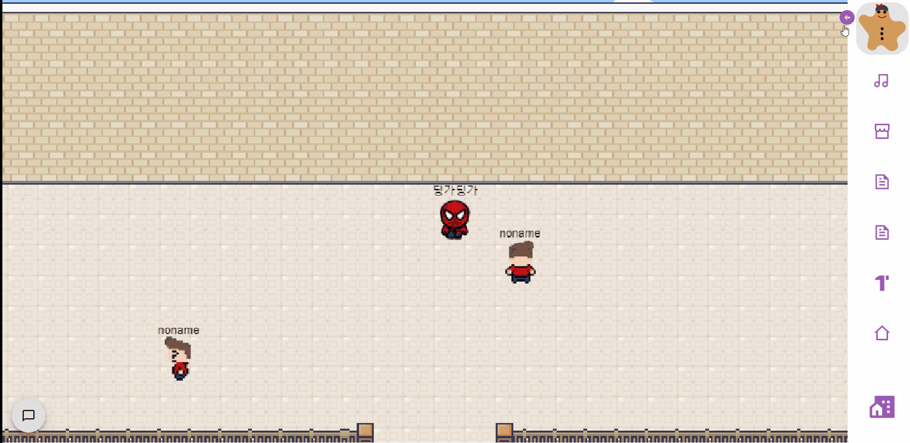


> 2. 아이템으로 방 꾸미기
>
> N-City에서 제공하는 다양한 아이템들(의자, 화이트보드, 소품 등)로 개성에 맞는 방 꾸미기 기능
>
> 화이트보드는 그림판 방명록으로, 의자는 앉기 상호작용 기능


<br>

#### 7. 실시간 채팅 및 유저간의 만남

> 같은 방에 있는 회원들은 채팅으로 실시간 상호작용이 가능하여, 작품에 대한 정보 교환 및 토론 가능


.gif)


<br>

<br>

## 3. 실행 방법

소스코드 다운로드

```
$ git clone https://lab.ssafy.com/s06-blockchain-nft-sub2/S06P22E106.git
```

<br>

### BackEnd

1. 디렉토리 이동

   ```
   $ cd backend
   ```

2. gradle 프로젝트를 빌드합니다.

   ```
   $ ./gradlew build
   ```

   - 정상적으로 빌드가 완료되면 `build` 폴더가 생성된 것을 확인 가능

   - `./gradlew build` 가 안되면 아래 명령어를 실행 후 빌드

     ```
     $ chmod 777 gradlew
     ```

3. 실행

   ```
   $ java -jar build/libs/ncity-0.0.1-SNAPSHOT.jar app.jar
   ```

<br>

### FrontEnd

1. 디렉토리 이동

   ```
   $ cd frontend
   ```

2. 필요한 package 설치

```
$ npm i
```

3. 실행

```
$ npm start
```

<br>

### GAME

1. 디렉토리 이동

   ```
   $ cd game
   ```

2. 필요한 package 설치

   ```
   $ npm i
   ```

3. 실행

   ```
   $ npm start
   ```

   
